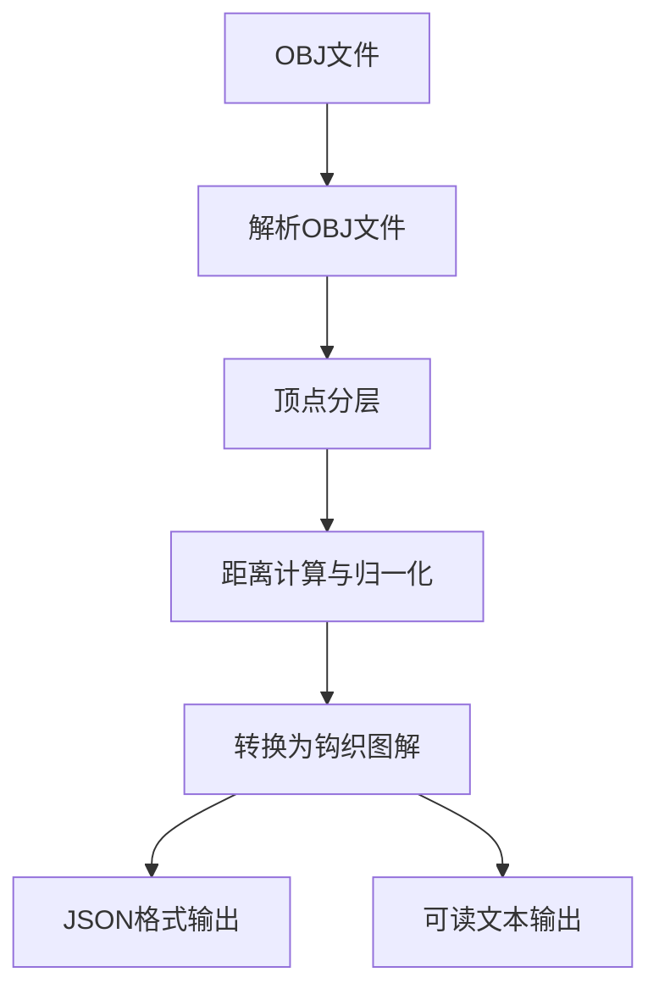
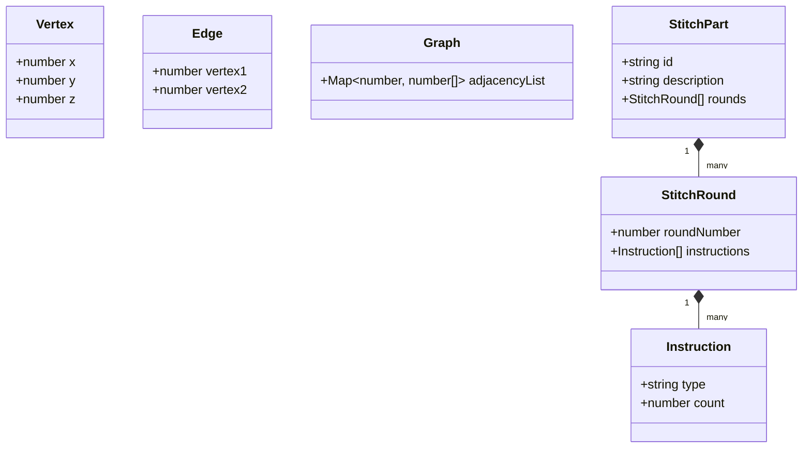
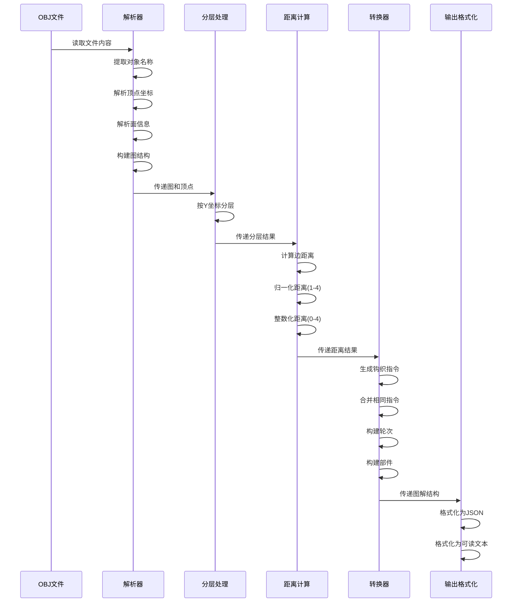
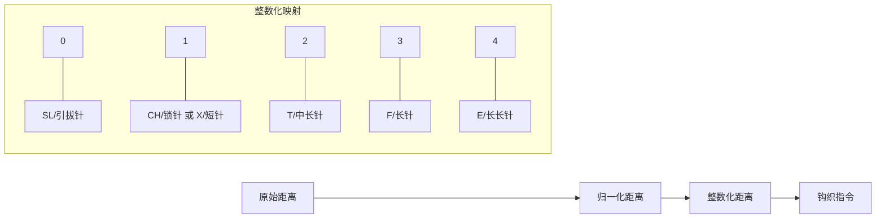

# OBJ 模型转钩织图解工具

这个工具可以将 3D 模型（OBJ 格式）转换为钩织图解语言，帮助手工艺爱好者根据 3D 模型创建钩织作品。

## 工作流程



## 工作原理

该工具通过以下步骤将 OBJ 文件转换为钩织图解：

### 1. 解析 OBJ 文件

- **提取对象名称**：从 OBJ 文件中读取对象名称（以 "o" 开头的行）
- **解析顶点**：读取所有顶点坐标（以 "v" 开头的行）
- **解析面**：读取所有面信息（以 "f" 开头的行），并将其转换为边的集合
- **构建图结构**：使用邻接表表示顶点之间的连接关系

### 2. 顶点分层

- **几何分层**：根据顶点的 y 坐标将顶点分成不同的层
- **BFS 分层**：可选择使用广度优先搜索算法进行分层，从指定起始顶点开始

### 3. 距离计算与归一化

- **计算边距离**：计算每条边（相邻顶点对）之间的欧几里得距离
- **归一化距离**：将距离归一化到 1-4 范围内
- **整数化距离**：将归一化后的距离转换为 0-4 的整数值

### 4. 转换为钩织图解

- **生成指令**：根据整数化的距离生成不同类型的钩织指令
  - 0 → SL（引拔针）
  - 1 → CH（锁针）|  X（短针）
  - 2 → T（中长针）
  - 3 → F（长针）
  - 4 → E（长长针）
- **合并指令**：合并相同类型的指令，累加其数量
- **构建轮次**：每一层对应一个钩织轮次
- **构建部件**：每个 OBJ 对象对应一个钩织部件

### 5. 输出图解

- **JSON 格式**：输出结构化的 JSON 格式图解
- **可读文本**：输出人类可读的文本格式图解（如 "P1: Cube\nR1: 4CH\nR2: 4X"）

## 数据结构



- **Vertex**: `[number, number, number]` - 表示 3D 空间中的一个点
- **Edge**: `[number, number]` - 表示连接两个顶点的边
- **Graph**: `Map<number, number[]>` - 邻接表表示的图结构
- **Instruction**: 表示一个钩织指令，包含类型和数量
- **StitchRound**: 表示一个钩织轮次，包含轮次编号和指令列表
- **StitchPart**: 表示一个钩织部件，包含 ID、描述和轮次列表

## 处理流程详解



## 使用方法

1. 准备一个 OBJ 格式的 3D 模型文件
2. 运行程序，指定 OBJ 文件路径
3. 程序将生成并显示钩织图解

## 示例输出

对于一个简单的立方体模型，输出的图解可能如下：

```
P1: Cube
R1: 4CH
R2: 4X
```

## 距离映射示意图



## 技术细节

该工具使用 TypeScript 实现，主要利用了图论和几何计算的概念。关键算法包括：

- 欧几里得距离计算
- 图的分层算法
- 距离归一化和离散化
- 指令合并和格式化

通过这些步骤，工具能够将复杂的 3D 模型转换为简单易懂的钩织图解，使手工艺爱好者能够创建出与 3D 模型相似的钩织作品。 